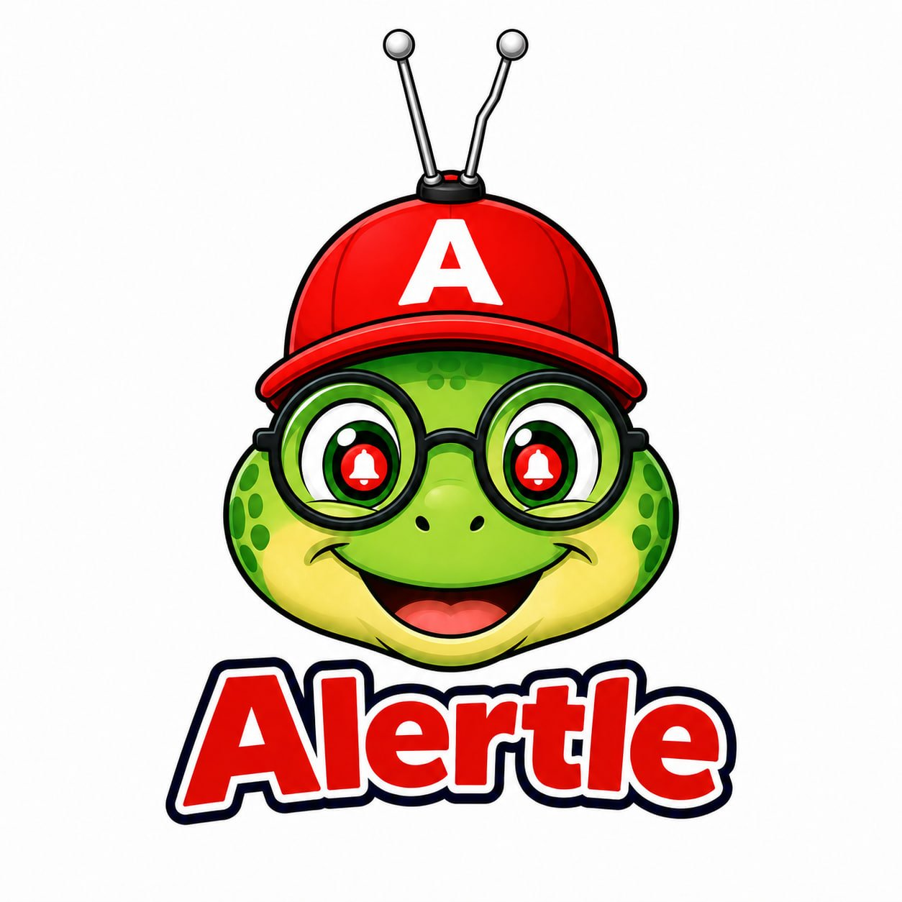

<p align="center">
  
</p>

<h1 align="center">Alertle-V2</h1>

<p align="center"><em>He's slow. Your alerts aren't.</em></p>

<p align="center">A self-hosted sports alert system. NHL, NBA, NFL, Soccer, Golf, F1, and more — straight to your phone.</p>

---

## Meet the Alertle Turtle 🐢

The Alertle Turtle is our mascot, our spirit animal, and our greatest irony. He is notoriously slow. He does not rush for anyone. And yet somehow, he always makes sure your game alerts arrive on time.

Don't miss a game. The Alertle Turtle's got you.

## ⚡ Vibe Coded

This entire project was built through conversation with Claude AI — no code was written by hand. No documentation was read. No Stack Overflow tabs were opened. Just vibes, prompts, and one very good turtle idea.

If it works, great. If something breaks, that's also the vibes. PRs are welcome. So is asking an AI about it.

---

## Quick Start

```yaml
services:
  alertle-v2:
    image: ghcr.io/deekerman/alertle-v2:b4f36b8
    container_name: alertle-v2
    pull_policy: always
    restart: unless-stopped
    environment:
      TZ: America/Toronto
    ports:
      - 8888:8888
    volumes:
      - ./alertle-v2/config.yaml:/config/config.yaml
      - alertle_data:/app/data
volumes:
  alertle_data: null
networks: {}
```

```bash
# Create the config directory and grab the example config
mkdir -p alertle-v2
curl -o alertle-v2/config.yaml https://raw.githubusercontent.com/Deekerman/Alertle-V2/main/config.yaml.example

# Edit config.yaml, then:
docker compose up -d
```

The web UI will be available at `http://localhost:8888`. The first-start wizard will walk you through the rest.

---

## Features

- Pulls live game schedules from ESPN for 20+ leagues across 7 sports
- Matches games to your actual channel lineup via [Dispatcharr](https://github.com/Dispatcharr/Dispatcharr/) or direct XMLTV sources
- Sends alerts via **Telegram**, **Discord**, **Pushover**, or **ntfy**
- Four alert modes: lead-time reminder, game-start, final score, and morning digest
- Per-league grouped morning digest with league logos (via [game-thumbs](https://github.com/sethwv/game-thumbs))
- Event-series support for Golf, Formula 1, Tennis, and MMA with broadcast schedule display
- Fully configurable notification templates with per-endpoint overrides
- 7-day lookahead scan with configurable daily scan time
- Web UI for managing subscriptions, endpoints, settings, and viewing upcoming alerts
- First-start setup wizard so you're not staring at a blank config
- Backup and restore — including import from V1

## How It Works

Alertle runs a daily scan (and on demand from the dashboard) that fetches upcoming games from the ESPN API for each of your subscriptions. It then cross-references those games against your EPG data — either from Dispatcharr or a direct XMLTV feed — to find which channels are broadcasting each game. Matched games are stored as scheduled alerts and fired via your configured notification endpoints at the times you've set up.

## Requirements

- Python 3.11+ (for `zoneinfo` support)
- A [Dispatcharr](https://github.com/Dispatcharr/Dispatcharr/) instance **or** a direct XMLTV URL — for channel matching
- One or more notification endpoints (Telegram bot, Discord webhook, Pushover app, or ntfy topic)

## Installation

### Quick Install (systemd)

```bash
git clone https://github.com/Deekerman/Alertle-V2.git
cd Alertle-V2
sudo bash install.sh
```

This installs to `/opt/alertle-v2` by default, creates a system user, and registers a systemd service on port **8888**. Override the install path with:

```bash
INSTALL_DIR=/custom/path sudo bash install.sh
```

After installation:
```bash
# Edit your config
sudo nano /opt/alertle-v2/config.yaml

# Manage the service
sudo systemctl start alertle-v2
sudo systemctl status alertle-v2
sudo journalctl -u alertle-v2 -f
```

### Docker

```bash
mkdir -p alertle-v2
curl -o alertle-v2/config.yaml https://raw.githubusercontent.com/Deekerman/Alertle-V2/main/config.yaml.example
curl -o docker-compose.yml https://raw.githubusercontent.com/Deekerman/Alertle-V2/main/docker-compose.yml
# Edit alertle-v2/config.yaml, then:
docker compose up -d
```

The web UI will be available at `http://localhost:8888`.

## Configuration

Copy `config.yaml.example` to `config.yaml` and edit. The web UI at `/settings` can manage most options after first launch.

```yaml
settings:
  timezone: "America/Toronto"
  scan_time: "06:00"          # Daily scan time (local timezone)
  standings_time: "18:00"     # Event series standings alert time

dispatcharr:
  url: "http://192.168.1.x:9191"
  api_key: "your-api-key"

game_thumbs:
  base_url: "https://game-thumbs.swvn.io"
  enabled: true
```

### Notification Endpoints

Add endpoints via the web UI or directly in `config.yaml`:

| Type | Required credentials |
|---|---|
| `telegram` | `bot_token`, `chat_id` |
| `discord` | `webhook_url` |
| `pushover` | `app_token`, `user_key` |
| `ntfy` | `url`, `topic` (+ optional `token`) |

```yaml
endpoints:
  - id: my-telegram
    type: telegram
    bot_token: "123456:ABC..."
    chat_id: "-100123456789"
    modes: [lead_time, game_summary, digest]
    lead_time_minutes: 30
    digest_time: "08:00"
    digest_team_days: 1    # today's team games only
    digest_event_days: 4   # next 4 days of event coverage
```

### Subscriptions

Three scope types are supported:

- **`league`** — all games in a league (e.g. all NHL games)
- **`team`** — a single team's games (e.g. Toronto Maple Leafs)
- **`event_series`** — ongoing events like PGA Tour, Formula 1, UFC (matched via EPG coverage)

```yaml
subscriptions:
  - label: "Toronto Maple Leafs"
    espn_sport: hockey
    espn_league: nhl
    espn_team_id: "10"
    scope: team
    endpoints: [my-telegram]

  - label: "PGA Tour"
    espn_sport: golf
    espn_league: pga
    scope: event_series
    standings_alert: true
    endpoints: [my-telegram]
```

### Alert Modes

| Mode | When it fires |
|---|---|
| `lead_time` | N minutes before tip-off (`lead_time_minutes`, default 30) |
| `game_start` | At the scheduled start time |
| `game_summary` | After the game ends, with the final score |
| `digest` | Morning summary of upcoming games, grouped by league |

### Notification Templates

Templates use `{variable}` substitution. Lines where every variable is empty are automatically dropped.

| Variable | Description |
|---|---|
| `{time}` | Game start time in your configured timezone |
| `{channels}` | Broadcast channels (or schedule for event series) |
| `{broadcast}` | Network names from ESPN |
| `{venue}` | Stadium / venue name and city |
| `{context}` | Season week, series standing, etc. |
| `{odds}` | Spread and over/under |
| `{score}` | Final score (game_summary mode only) |
| `{home}` / `{away}` | Team names |
| `{home_abbrev}` / `{away_abbrev}` | Team abbreviations |
| `{league}` / `{sport}` | League and sport identifiers |

Default template:
```
{time}
📺 {channels}
📍 {venue}
{context}
{odds}
{score}
```

## Supported Sports & Leagues

**Team Sports**
| Sport | Leagues |
|---|---|
| Football | NFL, NCAA Football, UFL |
| Basketball | NBA, WNBA, NCAA Men's, NCAA Women's |
| Baseball | MLB |
| Hockey | NHL |
| Soccer — England | Premier League, EFL Championship, EFL League One, EFL League Two, FA Cup, EFL Cup |
| Soccer — Scotland | Scottish Premiership |
| Soccer — Europe | La Liga, Bundesliga, Serie A, Ligue 1 |
| Soccer — Americas | MLS, NWSL |
| Soccer — Competitions | Champions League, Europa League, Conference League, FIFA World Cup, FIFA Women's World Cup |

**Event Series**
| Sport | Leagues |
|---|---|
| Golf | PGA Tour, LPGA Tour, DP World Tour |
| Racing | Formula 1 |
| MMA | UFC |
| Tennis | ATP Tour, WTA Tour |

## A HUGE Thank you to:

<table>
<tr>
<td width="50%">

### [Dispatcharr](https://github.com/Dispatcharr/Dispatcharr/)

Channel management and EPG aggregation. Alertle uses Dispatcharr's XMLTV output to match ESPN games to your actual channel lineup — so every notification tells you exactly which channel number to tune to.

</td>
<td width="50%">

### [game-thumbs](https://github.com/sethwv/game-thumbs)

Dynamic game artwork service. Alertle fetches matchup thumbnails and league logos from game-thumbs to include rich images in notifications and morning digests.

</td>
</tr>
</table>
